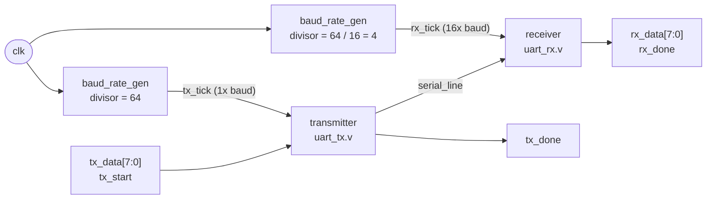
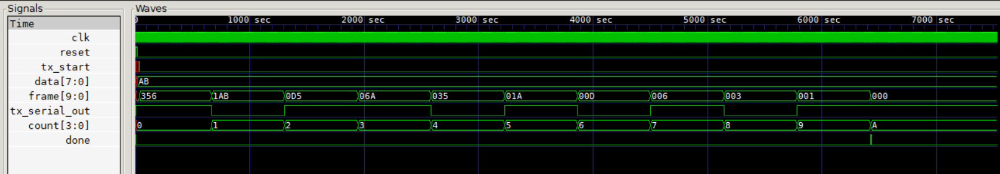
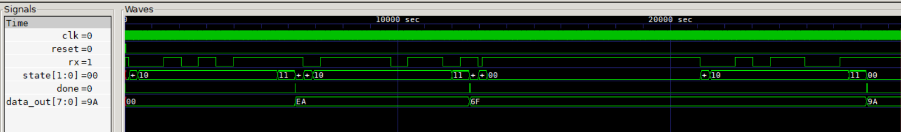
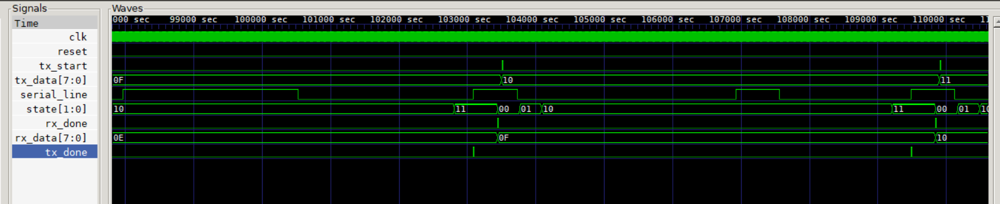

# UART-Transmitter-Receiver

8N1 UART transmitter and 16x-oversampling receiver in Verilog, with self-checking testbenches. TX-to-RX loopback verified for all 256 byte values, plus false-start rejection.

## Overview

This project is a complete, simulation-verified **UART (Universal Asynchronous Receiver/Transmitter)** written in synthesizable Verilog. It consists of:

- a **baud-rate generator** that divides the system clock down to the bit rate (and to 16x the bit rate for the receiver),
- a **transmitter** that serialises an 8-bit byte into a start bit + 8 data bits + stop bit frame,
- a **receiver** that recovers the byte from the serial line using 16x oversampling and rejects false start bits (glitches),
- a **top-level loopback module** that wires the transmitter's output straight into the receiver so the whole link can be tested with no external hardware.

Every block has its own testbench, and the top-level testbench sends all 256 possible byte values through the link and checks each one.

## Features

- **8N1 framing** - 1 start bit, 8 data bits (LSB first), no parity, 1 stop bit
- **Parameterised baud rate** - one `divisor` parameter sets the bit rate as `f_clk / divisor` (default `64`)
- **16x oversampling receiver** - samples every bit at its centre for noise tolerance
- **False-start rejection** - a glitch shorter than half a bit is discarded and the receiver returns to idle
- **Stop-bit validation** - a frame whose stop bit is not high is dropped (`done` is not asserted)
- **Self-checking testbenches** - print `PASS` / `FAIL` per byte; no manual waveform inspection needed
- Synchronous design: a single clock, synchronous active-high reset

## Architecture



| File | Module | Description |
|---|---|---|
| `baud_rate_gen.v` | `baud_rate_gen` | Counter that emits a one-clock `baud_tick` pulse every `divisor` clock cycles |
| `uart_tx.v` | `transmitter` | Loads a 10-bit frame `{stop, data, start}` and shifts it out one bit per `baud_tick` |
| `uart_rx.v` | `receiver` | 4-state FSM (idle, start, data, stop) clocked by a 16x tick |
| `uart_final.v` | `uart_topblock` | Top level: two baud generators + transmitter + receiver, connected in loopback |

### Frame format

```
idle   start   D0  D1  D2  D3  D4  D5  D6  D7   stop   idle
 1       0     <------- 8 data bits, LSB first ------>   1       1
```

Each frame is 10 bit-times long. With the default `divisor = 64` that is 640 clock cycles per frame, and the baud rate is `f_clk / 64` (for example, a 50 MHz clock gives 781.25 kbaud).

### Baud-rate generator

`baud_rate_gen #(.divisor(N))` counts from `0` to `N-1` and pulses `baud_tick` high for one clock cycle each time the count wraps.

| Port | Dir | Description |
|---|---|---|
| `clk` | in | System clock |
| `rst` | in | Synchronous reset, active high |
| `baud_tick` | out | One-cycle pulse every `divisor` clocks |

The top level instantiates it twice: `divisor = clk_bits` (64) for the transmitter, and `divisor = clk_bits / 16` (4) for the receiver, which gives the receiver 16 ticks per bit. `clk_bits` should therefore be a multiple of 16.

## Transmitter

On `tx_start` (accepted only while the transmitter is not busy) the byte is latched into a 10-bit frame register as `{1'b1, data, 1'b0}` - stop bit, data, start bit. On each `baud_tick` the register shifts right by one and the LSB is driven onto `tx_serial_out`. After 10 bit-times `busy` drops and `done` pulses for one clock. The line idles high.

| Port | Dir | Description |
|---|---|---|
| `clk` | in | System clock |
| `reset` | in | Synchronous reset, active high (line returns to idle high) |
| `tx_start` | in | Start a transmission (ignored while `busy`) |
| `data[7:0]` | in | Byte to send |
| `baud_tick` | in | Bit-rate tick from `baud_rate_gen` |
| `busy` | out | High from the accepted `tx_start` until the frame is complete |
| `done` | out | One-cycle pulse when the whole frame has been sent |
| `tx_serial_out` | out | Serial output line |

Because the baud generator free-runs, the start bit begins on the next `baud_tick` after `tx_start`, so there is up to one bit-time of latency before the line goes low.

**Waveform - transmitting `0xAB`.** `frame[9:0]` loads `0x356` (`1_1010_1011_0`) and shifts right once per bit period (`1AB`, `0D5`, `06A`, ... `000`) while `count` steps from 0 to `A` (10 bits). `done` pulses once the last bit has been sent.



## Receiver

The receiver is clocked by a 16x tick and runs a four-state FSM:

| State | What happens |
|---|---|
| `idle` (0) | Waits for `rx` to go low (possible start bit) |
| `start` (1) | Counts to the middle of the start bit (8 ticks) and checks `rx` is still low. If it is high again, the "start" was a glitch: go back to `idle`. |
| `data` (2) | Every 16 ticks (the centre of each bit) shifts in one bit of `rx`, LSB first, until 8 bits are collected |
| `stop` (3) | After 16 more ticks checks `rx` is high. If so, the byte is moved to `data_out` and `done` pulses for one clock; if not, the frame is discarded. |

| Port | Dir | Description |
|---|---|---|
| `clk` | in | System clock |
| `reset` | in | Synchronous reset, active high |
| `rx` | in | Serial input line |
| `baud_tick` | in | 16x-oversampling tick |
| `data_out[7:0]` | out | Last successfully received byte |
| `busy` | out | High while a frame is being received |
| `done` | out | One-cycle pulse when a valid byte has been received |

**Waveform - receiving `0xEA`, `0x6F`, a glitch, then `0x9A`.** `state` walks `00 -> 01 -> 10 -> 11` for each frame and `data_out` updates to `EA`, `6F` and `9A` with a `done` pulse after each stop bit. The short low pulse between `6F` and `9A` is the injected glitch: the receiver enters the start state, sees the line high at the mid-bit check, and returns to idle without a `done` pulse and without changing `data_out`.



## Top-level loopback

`uart_topblock` connects everything together: the transmitter's `tx_serial_out` drives an internal `serial_line` that feeds the receiver's `rx` input.

| Port | Dir | Description |
|---|---|---|
| `clk` | in | System clock |
| `reset` | in | Synchronous reset, active high (shared by all sub-blocks) |
| `tx_start` | in | Start sending `tx_data` |
| `tx_data[7:0]` | in | Byte to transmit |
| `rx_data[7:0]` | out | Byte recovered by the receiver |
| `tx_done` | out | Transmitter finished sending the frame |
| `rx_done` | out | Receiver has a valid byte on `rx_data` |

Parameter: `clk_bits` (default `64`) - clocks per bit; the receiver's tick divisor is derived as `clk_bits / 16`.

**Waveform - loopback.** Each `tx_start` pulse sends the next value on `tx_data` (`0F`, `10`, `11`) over `serial_line`. The receiver FSM (`state`) runs through the frame and `rx_data` follows (`0F`, `10`, `11`), with `rx_done` pulsing shortly after `tx_done`.



> The time axis in these GTKWave screenshots is labelled `sec`; this is GTKWave's default label. The testbenches have no `timescale`, so the units are simply simulation time units (the clock period is 10 units).

## Testbenches

| Testbench | Tests | What it checks |
|---|---|---|
| `baud_rate_gen_tb.v` | `baud_rate_gen` | Prints `baud_tick` against the clock to confirm the divide ratio (visual) |
| `uart_tx_tb.v` | `transmitter` | Sends `0xAB`, writes `uart_tx_tb.vcd` for waveform inspection (visual) |
| `uart_rx_tb.v` | `receiver` | Self-checking: receives `0xEA`, `0x6F`, a false start bit (glitch), then `0x9A` |
| `uart_final_tb.v` | `uart_topblock` | Self-checking: sends every byte from `0x00` to `0xFF` through the loopback and compares `rx_data` with `tx_data` |

### Results

Simulated with Icarus Verilog 12:

- `uart_final_tb` - **256 / 256 bytes pass, 0 fail**
- `uart_rx_tb` - **3 / 3 bytes match, glitch rejected** (`PASS, gltich rejected !`)

## Running the simulations

Requires [Icarus Verilog](https://steveicarus.github.io/iverilog/) and, optionally, [GTKWave](https://gtkwave.sourceforge.net/) for viewing waveforms.

**Full loopback test (all 256 bytes):**

```bash
iverilog -o uart_final_sim baud_rate_gen.v uart_tx.v uart_rx.v uart_final.v uart_final_tb.v
vvp uart_final_sim
```

Expected end of output:

```
PASS values :         256
FAIL values :           0
```

**Receiver test (including glitch rejection):**

```bash
iverilog -o uart_rx_sim baud_rate_gen.v uart_rx.v uart_rx_tb.v
vvp uart_rx_sim
```

**Transmitter test:**

```bash
iverilog -o uart_tx_sim baud_rate_gen.v uart_tx.v uart_tx_tb.v
vvp uart_tx_sim
```

**Baud-rate generator test:**

```bash
iverilog -o baud_sim baud_rate_gen.v baud_rate_gen_tb.v
vvp baud_sim
```

**View waveforms** (the testbenches write `uart_tx_tb.vcd`, `uart_rx_tb.vcd` and `uart_final_tb.vcd`):

```bash
gtkwave uart_final_tb.vcd
```

## Design notes and limitations

- The frame format is fixed at 8N1: no parity bit and no configurable stop bits. The receiver's `data_bits` parameter exists, but its shift path and `data_out` are 8 bits wide, so 8 is the only supported value.
- A frame with an invalid stop bit (framing error) is silently dropped; there is no separate error flag.
- In the loopback, the transmitter and receiver share one clock, so the simulation does not exercise baud-rate mismatch or clock drift between two independent devices.
- The testbenches check the loopback and the false-start case; a framing-error test case is not included.

## Repository structure

```
.
├── baud_rate_gen.v        # baud tick generator
├── baud_rate_gen_tb.v
├── uart_tx.v              # transmitter
├── uart_tx_tb.v
├── uart_rx.v              # receiver
├── uart_rx_tb.v
├── uart_final.v           # top-level TX -> RX loopback
├── uart_final_tb.v
├── uart_transmitter_block.png   # transmitter waveform
├── uart_rx_block.png            # receiver waveform
├── uart_final_loopback.png      # loopback waveform
├── .gitignore             # ignores simulator output and .vcd dumps
└── README.md
```
